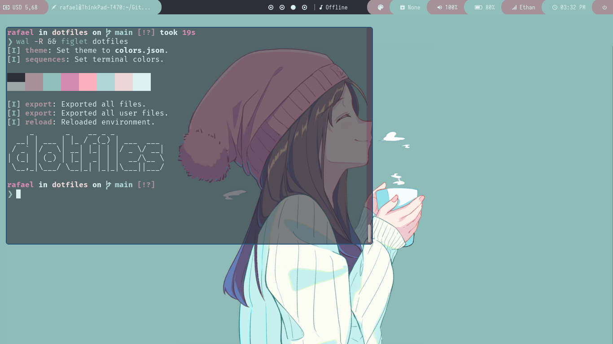
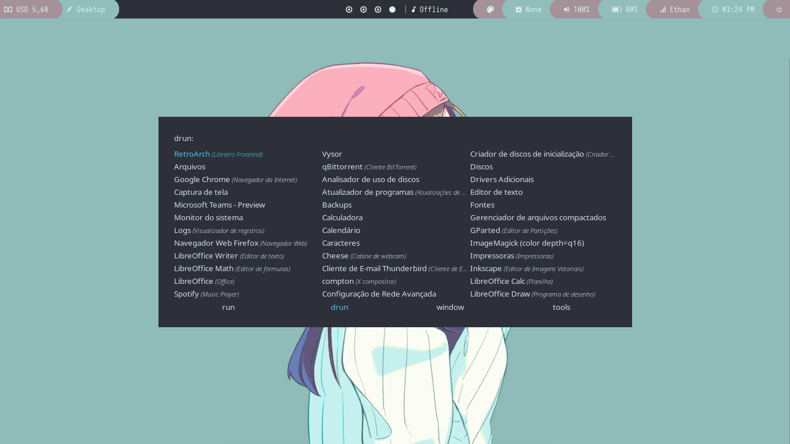

<h1 align="center">
  
</h1>

> Um backup das minhas configurações pessoais

## Author

👦 **Rafael**

* Github: [@inacio0196](https://github.com/inacio0196)
* LinkedIn: [@Rafael Inácio](https://www.linkedin.com/in/rafael-in%C3%A1cio-53a3ab1a2/)

## Show your support

Give a ⭐️ if this project helped you!

***

## Polybar

> O Polybar tem como objetivo ajudar os usuários a construir belas e altamente personalizáveis ​​barras de status para seu ambiente de desktop. Aqui está uma captura de tela mostrando a minha configuração atual:

*O que me fez utilizar no dia a dia?*

1. Vocễ pode criar modulos personalizados para qualquer tipo de tarefa, o modulo USD por exemplo é feito em Shell Script, básicamente ele baixa o html de um site com a cotação do dolar, filtra o valor atual e mostra o resultado. Você pode conferir o código dando uma olhada em **config/polybar/shapes/scripts/getDollar.sh**.

2. O [polybar](https://github.com/polybar/polybar) se mostra uma opção mais completa e elegante comparado a barra de status padrão do [i3wm](https://i3wm.org/).

3. A simplicidade, ela não abre nenhum tipo de lançador de aplicativos nem nada além de mostrar informações básicas, mas poderia fazer esse tipo de coisa tranquilamente, basta colocar a mão na massa e fazer acontecer 😎.

<h3 align="center"></h3>

Você ainda pode utilizar a sua polybar em conjunto com o [pywall](https://github.com/dylanaraps/pywal) para que ela sempre fique combinando com o seu papel de parede. 🤯

## Desktop

*Puramente i3wm*

> i3 é um gerenciador de janelas lado a lado , totalmente escrito do zero.

- Não preciso fazer uso do mouse para navegar entre as telas pode parecer bobeira mas isso poupa 🕐 a longo prazo, a divisão por **Áreas de Trabalho** facilita muito depois que se torna um comportamento automático usar teclas de atalho para quase tudo deixa tudo mais ágil. O arquivo de configuração padrão é bem amigável 🤝 e nele você automatizar quase tudo como por exemplo rodar um script ou comando sempre que iniciar o computador. 🦸 Você pode dar uma olhada no meu em **config/i3/config**.

## Rofi

> Rofi , como dmenu, fornecerá ao usuário uma lista textual de opções onde uma ou mais podem ser selecionadas. Isso pode ser a execução de um aplicativo, a seleção de uma janela ou opções fornecidas por um script externo e pode facilmente ser acessado após um atalho criado dentro do arquivo de configuração no i3wm.

- O [rofi](https://github.com/davatorium/rofi) pode ser muito mais que um simples lançador de aplicativos, o que tenho aqui por exemplo é como um primo do [Spotlight](https://support.apple.com/pt-br/guide/mac-help/mchlp1008/mac) porém na minha configuração ele por enquanto só é capaz de fazer essas coisas:

- [x] Pesquisar programas pelo nome.
- [x] Selecionar e Abrir todas as janelas ativas.
- [x] Rodar comandos do terminal sem abrir o mesmo.

Veja que na imagem existe uma sessão chamada **tools**, ainda estou trabalhando nela aos poucos, mas a ideia é basicamente promover alguns comandos "quebra-galho" de forma que possam ser acessados de forma rápida sempre que necessário.
